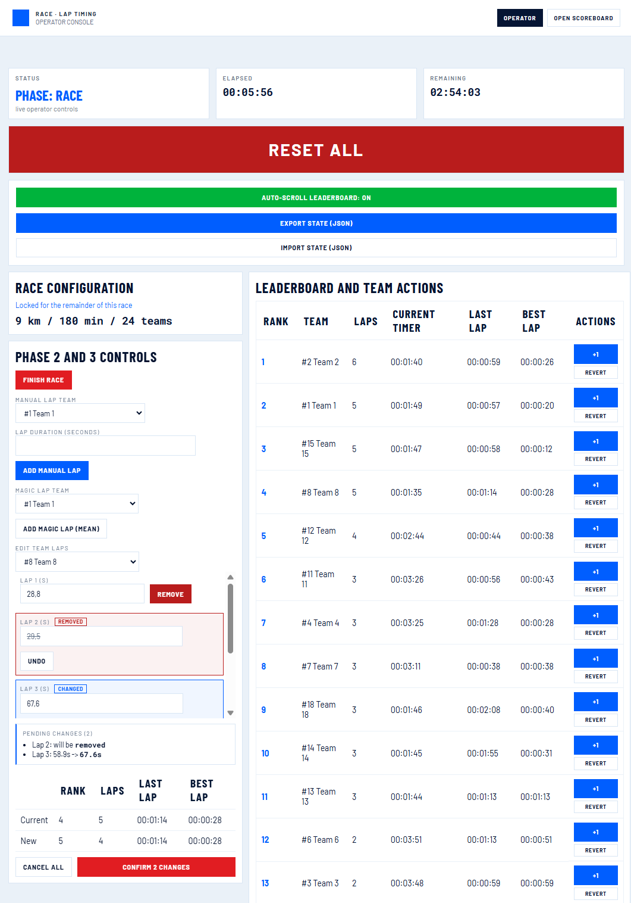
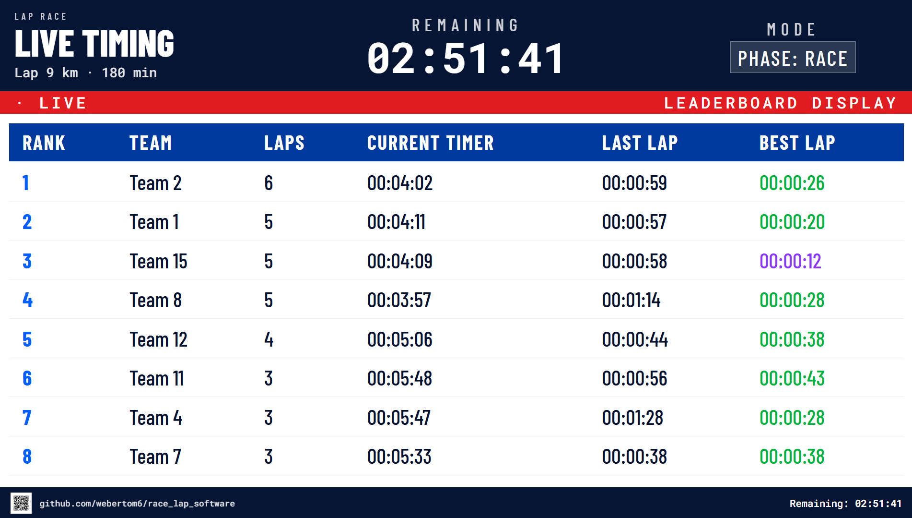
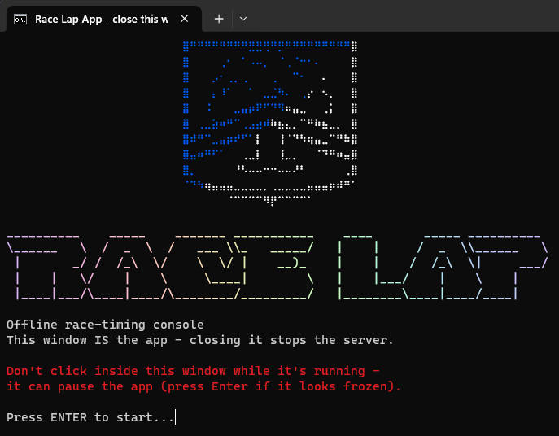

# Race Lap App

```
__________    _____    _______ ___________    ____       _____ __________ 
\______   \  /  _  \  /   ___ \\_   _____/   |    |     /  _  \\______   \
 |       _/ /  /_\  \/    \  \/ |    __)_    |    |    /  /_\  \|     ___/
 |    |   \/    |    \     \____|        \   |    |___/    |    \    |    
 |____|___/\____|____/\________/_________/   |________\____|____/____|           
```

---

This side-project is destined for youth movement, association, etc. making a **race with laps event** which want to have a free software to handle the race data and display the leaderboard to the public and **can work without WIFI**. This is clearly not my field but, I didn't want to see my team use AI-slop (or worse buy it).

I try to make this app clear/simple as possible such that non-technical person that want to customize can and the installation/use required only `uv`. The best would be to be accessible by a large public at once but difficult now.

<p align="center">
  
  &nbsp;&nbsp;
  
</p>
<p align="center"><em>Operator console (left) and public scoreboard (right) - two screens, always in sync</em></p>

---

## install and run (easiest way)

**1 - download**

Download the ZIP from GitHub (green "Code" button -> "Download ZIP") and unzip it, or clone it:

```bash
git clone https://github.com/webertom6/race_lap_software.git
```

**2 - double-click the script for your system**

| OS | file |
|---|---|
| Windows | `run-windows.bat` |
| macOS | `run-macos.command` |
| Linux | `run-linux.sh` |

The script installs `uv` if it's missing, installs the app's dependencies, starts the server, and opens the app in your browser automatically. The terminal window it opens **is** the app - closing that window stops the server.

<p align="center">
  
</p>
<p align="center"><em>What double-clicking the script looks like</em></p>

- First run needs an internet connection once, to install `uv` and download the dependencies. After that, the app works fully offline.
- **macOS**: the first time, right-click `run-macos.command` and choose "Open" (instead of double-clicking) - macOS blocks unsigned downloaded scripts by default, and this is the one-time way past that warning.
- **Linux**: double-click support depends on your file manager and isn't guaranteed. If it doesn't work, open a terminal in this folder and run `./run-linux.sh`.

---

## install and run (manual)

**1 - clone or download**

```bash
git clone https://github.com/webertom6/race_lap_software.git
cd race_lap_software
```

or download the ZIP from GitHub (green "Code" button -> "Download ZIP"), unzip it, then open a terminal in that folder.

**2 - install dependencies with uv**

```bash
uv sync
```

if `uv` is not installed [Astral doc - Installing uv](https://docs.astral.sh/uv/getting-started/installation/) :

```bash
# windows (powershell)
powershell -ExecutionPolicy ByPass -c "irm https://astral.sh/uv/install.ps1 | iex"

# macOS / linux
curl -LsSf https://astral.sh/uv/install.sh | sh
```

then run `uv sync` again.

---

## run

```bash
uv run app.py
```

the terminal will print the local addresses + QR code, for example:

```
08:00:00 Server started on port 8095 -- share one of these addresses:
08:00:00   http://192.168.1.42:8095
```

open in a browser:

| page | url |
|---|---|
| operator console | [http://localhost:8095](http://localhost:8095) |
| scoreboard display | [http://localhost:8095/scoreboard](http://localhost:8095/scoreboard) |

to open the scoreboard on a TV or phone on the same network, use the IP address printed in the terminal.

## sharing

1. Windows Settings -> Network & Internet -> Mobile Hotspot -> Enable
2. Connect your phone to that hotspot
3. Run ipconfig -> look for Local Area Connection adapter -> its IPv4 (usually 192.168.137.1) OR test QR code at start
4. Start the server, open http://192.168.137.1:8095 on your phone

## checks

```bash
uv run ruff check .
uv run python -m py_compile app.py race_state.py api_handlers.py autosave.py network.py
node --check static/operator.js
node --check static/scoreboard.js
node --check static/shared.js
```

---

## features

- **registration phase**
  - add teams (number + name)
  - set lap distance and race duration
- **race phase**
  - record laps (+1 per team)
  - revert last lap
  - manual lap entry
  - magic lap (mean duration)
- **finished phase**
  - results locked
  - final charts (laps over time, lap duration over time)
- operator page adapts to phone and tablet for use during the race
- scoreboard scales for large TV displays (4K)

---

## notes

- race state is autosaved to the local, gitignored `race_state_autosave.json` file and restored after a restart
- when an active race resumes after downtime, its timing data shifts so the clock continues from the saved point
- to share the operator page with another device on the same network, open the IP address printed at startup

---

## license

MIT License - Copyright (c) 2026 Tom Weber - see [LICENSE](LICENSE)
